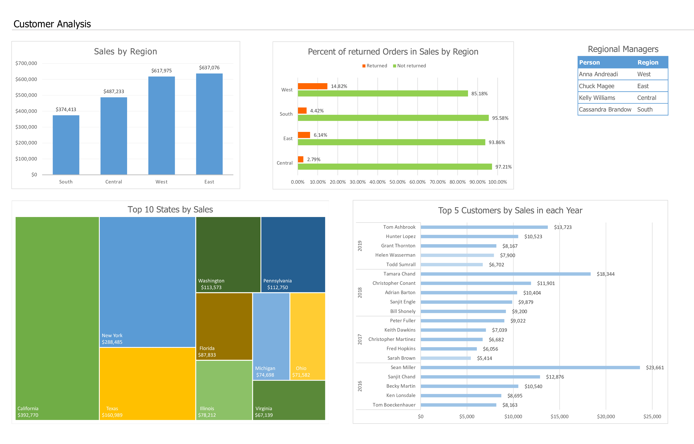

# Module 1

## The Architecture of Analytics Solution 

The Architecture of Analytics Solution of Superstore made in draw.io.

**Source Layer**

This layer is responsible for connecting to the data sources. It works with raw data from various sources like source databases, CRM systems, and Google Analytics API.

**Storage Layer**

This layer is responsible for storing data for processing and long-term use. It's proposed to use ELT processes and store data in Data Lake. It will help to speed up the data storing process and allow us to analyze data more deeply.

**Business Layer**

The Business layer consists of Excel workflow, Tableau dashboards, and working with SQL queries.

## Analysis in Excel

### Overview

The overview dashboard includes KPI metrics like "Total Sales", "Total profit", and "Profit margin", diagrams of Sales, Profit, and Orders in dynamics, and slices by Product Segment.
___
### Product dashboard

The product dashboard makes a view of Sales and Profit by Product Categories.
___
### Customer Analysis

The customer Analysis dashboard represents Sales volume depending on the Region. A diagram of Returned Orders allows us to determine the Region where there are more refunds than in others and indicate this to the regional manager. 

[Move to the top ^](#module-1)